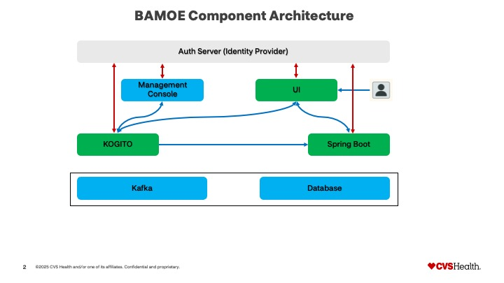

# BAMOE Ecosystem

**Business Automation Management Open Edition 9.3.0** - Complete process automation platform.

## Architecture



## Quick Start

### Prerequisites
- Docker & Docker Compose
- Node.js 18+
- Java 17+
- Maven 3.8+

### 1. Start Infrastructure
```bash
cd quarkus-bamoe-app
docker-compose up -d
```

### 2. Start Backend Services
```bash
# Terminal 1 - BAMOE Process Engine
cd quarkus-bamoe-app
./mvnw quarkus:dev

# Terminal 2 - Spring Boot API (PostgreSQL - default)
cd spring-boot-api
./mvnw spring-boot:run

# Alternative: Spring Boot API with H2 (development only)
cd spring-boot-api
./mvnw spring-boot:run -Dspring.profiles.active=h2
```

### 3. Start Frontend
```bash
cd angula-bamoe-ui
npm install
npm start
```

## Access Points

| Service | URL | Purpose |
|---------|-----|---------|
| Angular UI | http://localhost:4200 | Main application |
| Keycloak | http://localhost:9180 | Authentication |
| BAMOE Process | http://localhost:8080 | Process engine |
| Spring Boot API | http://localhost:8081 | Resource service |
| BAMOE Console | http://localhost:9280 | Process monitoring |

## Default Credentials

### Keycloak Configuration
- **Keycloak Admin**: admin / admin123
- **Realm**: quarkus-realm
- **Client**: quarkus-bamoe-frontend

### User Accounts (Password: password123)
- **smith** - Admin
- **jones** - Manager
- **brown** - User
- **davis** - Analyst
- **miller** - Tech Support
- **wilson** - Tech Support
- **moore** - Business Support
- **taylor** - Business Support

## Technology Stack

- **Frontend**: Angular 19 + Material Design
- **Backend**: Quarkus 3.20.1 + BAMOE 9.3.0
- **API**: Spring Boot + REST
- **Auth**: Keycloak 24.0 (OIDC)
- **Database**: PostgreSQL 17 (default), H2 (dev profile)
- **Messaging**: Apache Kafka (optional)

## Environment Configuration

### Database Configuration
The Spring Boot API uses PostgreSQL by default with these environment variables:
- `DB_HOST` - Database host (default: localhost)
- `DB_PORT` - Database port (default: 5432)
- `ENQUIRY_DB_NAME` - Database name (default: enquiry-db)
- `DB_USER` - Database username (default: quarkus)
- `DB_PASSWORD` - Database password (default: quarkus)

### Development with H2
For local development without PostgreSQL, use the h2 profile:
```bash
./mvnw spring-boot:run -Dspring.profiles.active=h2
```

## Features

- OAuth2/OIDC Authentication
- Process Automation & Workflow
- Task Management
- Enquiry Management
- Process Visualization
- Role-based Access Control
- Event Streaming
- Process Monitoring
